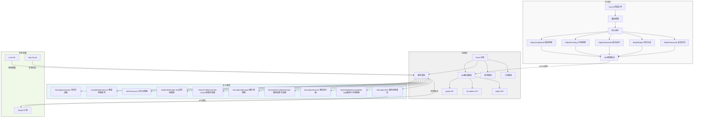

EE50-F6D0# MiroFish 项目架构图

## 架构说明

### 1. 前端层
- **Vue.js 前端应用**：使用Vue 3构建的单页应用，提供用户界面
- **核心组件**：
  - Step1GraphBuild：负责图谱构建和种子信息提取
  - Step2EnvSetup：负责环境搭建和智能体配置
  - Step3Simulation：负责启动和监控模拟过程
  - Step4Report：负责展示预测报告
  - Step5Interaction：负责与模拟世界的深度互动
- **API调用模块**：处理与后端的通信

### 2. 后端层
- **Flask 应用**：后端核心框架，提供RESTful API
- **API路由模块**：
  - graph API：处理图谱构建相关请求
  - simulation API：处理模拟运行相关请求
  - report API：处理报告生成相关请求
- **服务模块**：实现核心业务逻辑
- **模型模块**：定义数据模型
- **工具模块**：提供通用工具函数

### 3. 核心服务
- **OntologyGenerator**：生成领域本体
- **GraphBuilderService**：构建知识图谱
- **TextProcessor**：处理和分析文本
- **ZepEntityReader**：从Zep读取实体信息
- **OasisProfileGenerator**：生成OASIS智能体配置
- **SimulationManager**：管理模拟状态和生命周期
- **SimulationConfigGenerator**：生成模拟配置参数
- **SimulationRunner**：执行模拟过程
- **ZepGraphMemoryUpdater**：更新Zep中的图谱记忆
- **SimulationIPC**：处理与OASIS引擎的进程通信

### 4. 外部依赖
- **LLM API**：提供大语言模型能力，支持文本处理和智能决策
- **Zep Cloud**：提供长期记忆管理能力
- **OASIS 引擎**：提供智能体仿真能力

## 数据流程
1. 用户通过前端上传种子材料（如新闻、报告、小说等）
2. 前端调用后端API，发送种子材料
3. 后端通过TextProcessor处理文本，提取关键信息
4. GraphBuilderService构建知识图谱，存储到Zep Cloud
5. OasisProfileGenerator生成智能体配置
6. SimulationRunner启动OASIS引擎进行模拟
7. 模拟过程中，ZepGraphMemoryUpdater持续更新记忆
8. 模拟完成后，生成预测报告
9. 前端展示报告，用户可与模拟世界进行互动

## 技术特点
- **多智能体架构**：基于OASIS引擎实现智能体交互
- **知识图谱**：使用GraphRAG技术增强智能体决策
- **长期记忆**：通过Zep Cloud实现智能体长期记忆
- **双平台模拟**：支持Twitter和Reddit平台的模拟
- **深度互动**：用户可与模拟世界中的智能体对话

MiroFish通过这种架构实现了从现实种子到数字世界的映射，通过智能体的交互和演化，预测未来的发展趋势，为决策提供支持。